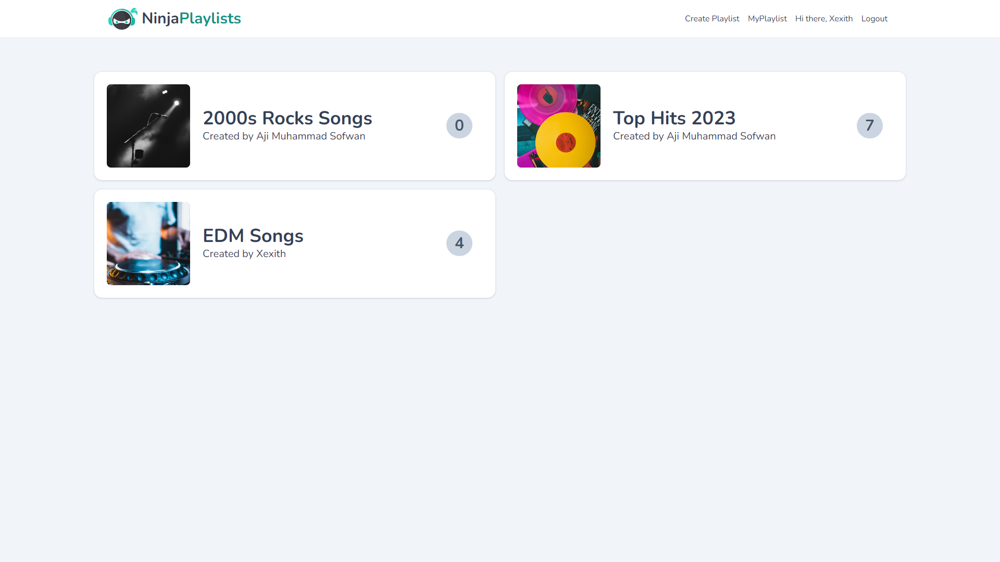

# Song Playlist App

This is a Song Playlist app built using Vue.js and Vite, with Firebase Firestore for the database and Firebase Storage for file storage.

## Features

- **Add Songs:** Users can add their favorite songs to the playlist.
- **Delete Songs:** Remove unwanted songs from the playlist.
- **Firebase Integration:** Utilizes Firebase Firestore for database storage and Firebase Storage for file storage.

## Technologies Used

- Vue.js
- Vite
- Firebase Firestore
- Firebase Storage

## Demo

You see the demo using this link [https://musoninjas-ca821.web.app/](https://musoninjas-ca821.web.app/).